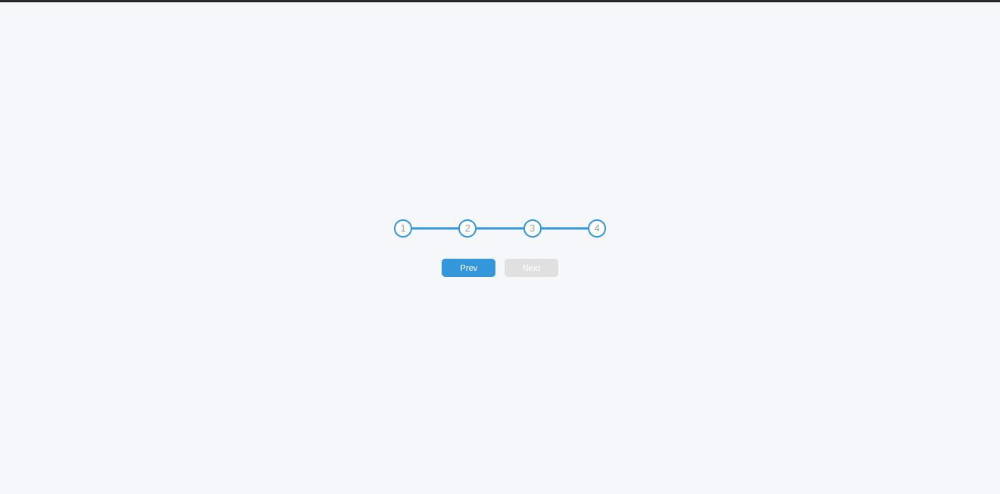

# Personal Project - Progressive Step For Registration Forms

This is an Progressive Steps projects.

## Table of contents

- [Overview](#overview)
  - [The challenge](#the-challenge)
  - [Screenshot](#screenshot)
  - [Links](#links)
- [My process](#my-process)
  - [Built with](#built-with)
  - [What I learned](#what-i-learned)
  - [Continued development](#continued-development)
  - [Useful resources](#useful-resources)
- [Author](#author)
- [Acknowledgments](#acknowledgments)

## Overview

### The challenge

Users should be able to:

- See the steps progress on click of the next button and return to previous on the click of the prev button.

### Screenshot



### Links

- Solution URL: [https://github.com/ababaug/progressive_steps]
- Live Site URL: [https://ababaug.github.io/progressive_steps/]

## My process

### Built with

- Semantic HTML5 markup
- CSS custom properties
- Flexbox
- Mobile-first workflow
- JavaScript

**Note: These are just examples. Delete this note and replace the list above with your own choices**

### What I learned

Use this section to recap over some of your major learnings while working through this project. Writing these out and providing code samples of areas you want to highlight is a great way to reinforce your own knowledge.

To see how you can add code snippets, see below:

```html
<body>
  <div class="container">
    <div class="progress-container">
      <div class="progress" id="progress"></div>
      <div class="circle active">1</div>
      <div class="circle">2</div>
      <div class="circle">3</div>
      <div class="circle">4</div>
    </div>

    <button class="btn" id="prev" disabled>Prev</button>
    <button class="btn" id="next">Next</button>
  </div>

  <script src="script.js"></script>
</body>
```

```css
@import url("https://fonts.googleapis.com/css2?family=Mulish:ital,wght@0,200..1000;1,200..1000&display=swap");

:root {
  --line-border-fill: #3496db;
  --line-border-empty: #e0e0e0;
}

* {
  box-sizing: border-box;
}

body {
  font-family: "Mulish", sans-serif;
  background-color: #f6f7fb;
  display: flex;
  align-items: center;
  justify-content: center;
  height: 100vh;
  margin: 0;
  padding: 0;
  overflow: hidden;
}

.container {
  text-align: center;
}

.progress-container {
  display: flex;
  justify-content: space-between;
  margin-bottom: 30px;
  max-width: 100%;
  width: 350px;
  position: relative;
}

.progress-container::before {
  content: "";
  background-color: var(--line-border-empty);
  position: absolute;
  top: 50%;
  left: 0;
  transform: translateY(-50%);
  height: 4px;
  width: 100%;
  z-index: -1;
}

.progress {
  background-color: var(--line-border-fill);
  position: absolute;
  top: 50%;
  left: 0;
  transform: translateY(-50%);
  height: 4px;
  width: 0%;
  z-index: -1;
  transition: 4s ease;
}

.circle {
  background-color: #fff;
  color: #999;
  border-radius: 50%;
  height: 30px;
  width: 30px;
  display: flex;
  align-items: center;
  justify-content: center;
  border: 3px solid var(--line-border-empty);
  transition: 0.4s ease;
}

.circle.active {
  border: 3px solid var(--line-border-fill);
}

.btn {
  background-color: var(--line-border-fill);
  color: white;
  border: 0;
  border-radius: 6px;
  cursor: pointer;
  font-family: inherit;
  font-size: 14px;
  padding: 8px 30px;
  margin: 5px;
}

.btn:active {
  transform: scale(0.9);
}

.btn:focus {
  outline: 0;
}

.btn:disabled {
  cursor: not-allowed;
  background-color: var(--line-border-empty);
}
```

```JS
const progress = document.getElementById('progress');

const prev = document.getElementById('prev');

const next = document.getElementById('next');

const circles = document.querySelectorAll('.circle');

let currentActive = 1;

next.addEventListener('click', ()=>{
    currentActive++;

    if(currentActive >= circles.length){
        currentActive = circles.length;
    }

    update();
})

prev.addEventListener('click', ()=>{
    currentActive--;

    if(currentActive < 1){
        currentActive = 1;
    }

    update();
})

function update() {
    circles.forEach((circle, idx) => {
        if(idx < currentActive){
            circle.classList.add('active');
        }
        else{
            circle.classList.remove('active');
        }
    });

    const actives = document.querySelectorAll('.active');

    progress.style.width = ((actives.length-1)/(circles.length-1))*100 + "%";

    if(currentActive === 1){
        prev.disabled = true;
    }
    else if(currentActive === circles.length){
        next.disabled = true;
    }
    else {
        prev.disabled = false;
        next.disabled = false;
    }
}
```

## Author

- Website - [https://www.linkedin.com/in/augustine-stephen-abah-51103090/]
- Frontend Mentor - [@ababaug](https://www.frontendmentor.io/profile/ababaug)
